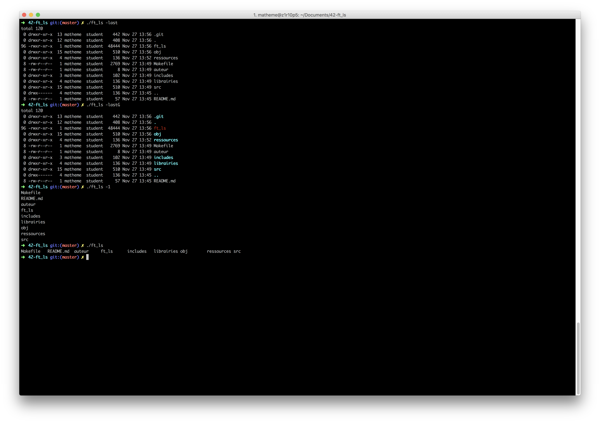

# Cursus 42
the project ft_ls is about recode the shell command ls
ft_ls is the first project of the system branch of 42 cursus
the system branch is split in 4 project
. ft_ls
. minishell
. 21sh
. 42 sh
I help myself using the function ft_printf that i have recobe before realise this command shell.

# 42-ft_ls
As simple as listing the files in a directory

# Foreward
the recipe for “Choucroute” Sauerkraut Alsatian style

# Objectives
The project ft_ls opens the path to the Unix branch of the sphere system. For the first
time, you will have to face the one libc functions that will allow you to do other things
than just read or write on a file descriptor (this is to simplify of course). You will discover
a sub-system of functions of operating system’s API, the associated data structures, as
well as the management of memory allocation and the associated data.

# Compiling and run the command shell
Run command `Make` at the root of the repo then
Run the ft_ls command with `./ft_ls`
ft_ls allow the option:
`-G`	for color
`-R`	for recursive
`-a`	for hiden files
`-l`	in line with details
`-p`	for add a / after each directory	
`-r`	reverse
`-s`	for show files system block	
`-t`	sort by create time
`-u`	sort by update time
`-1`	in line without detail

#Command output

